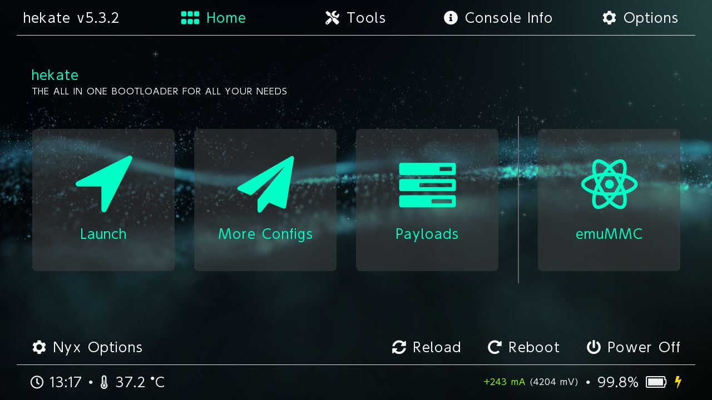
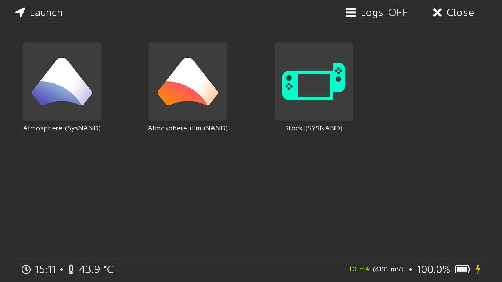
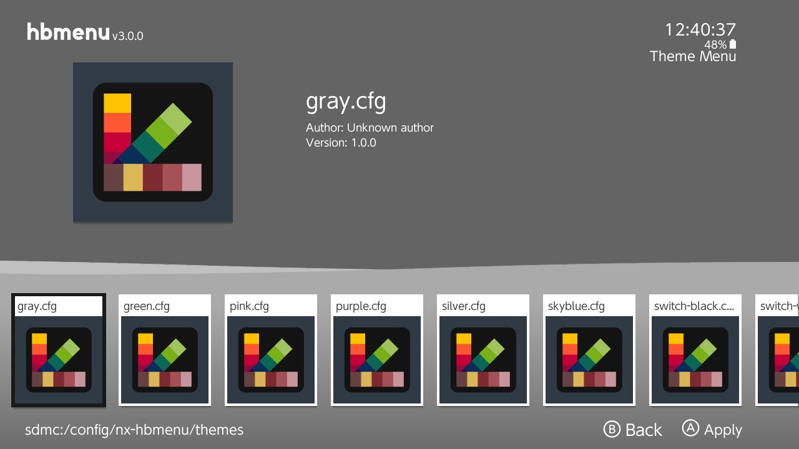

=====

## Features

- Hekate＆Atmosphere Only(HekateとAtmosphereのみ)
- No Splash screen(スプラッシュスクリーンは邪魔なので入れてません)
- Included only the minimum amount of homebrew and plugin(リリース早めるために自作ソフトもプラグインも最低限のものしか入れていません)
- Added hbm color config(hbm用のカラー設定集)
- Default Cheat OFF(チートをデフォルトでOFFに設定しています)

## How to use
Follow this guide to hack your switch: https://switch.homebrew.guide

Download the latest release and put it on your SD Card 
Send the hekate-payload.bin to your Switch in RCM mode and launch the CFW

日本の方はこちらへ
https://yyoossk.blogspot.com/2021/04/hekateatmosphereatmosphere-with-hekate.html

Please install sigpatch yourself 
sigpatchは下記リンクのものを入れてください 
https://github.com/ITotalJustice/patches/releases 
or AIO-switch-updater 
またはAIO-switch-updaterで導入してください 
https://github.com/HamletDuFromage/AIO-switch-updater/releases/ 

## WHAT'S INCLUDED?

| Software |
| -------- | 
| [Atmosphère](https://github.com/Atmosphere-NX/Atmosphere) |
| [Hekate](https://github.com/CTCaer/hekate) |
| [Hekate-Toolbox](https://github.com/WerWolv/Hekate-Toolbox) |
| [aio-switch-updater](https://github.com/HamletDuFromage/aio-switch-updater) |
| [sys-ftpd-light](https://github.com/cathery/sys-ftpd-light) |

## Credits
* Thanks to SciresM and CTCaer and WerWolv and HamletDuFromage and cathery

## Contact
https://twitter.com/Cloud0835

## My Site
https://yyoossk.blogspot.com/search/label/
